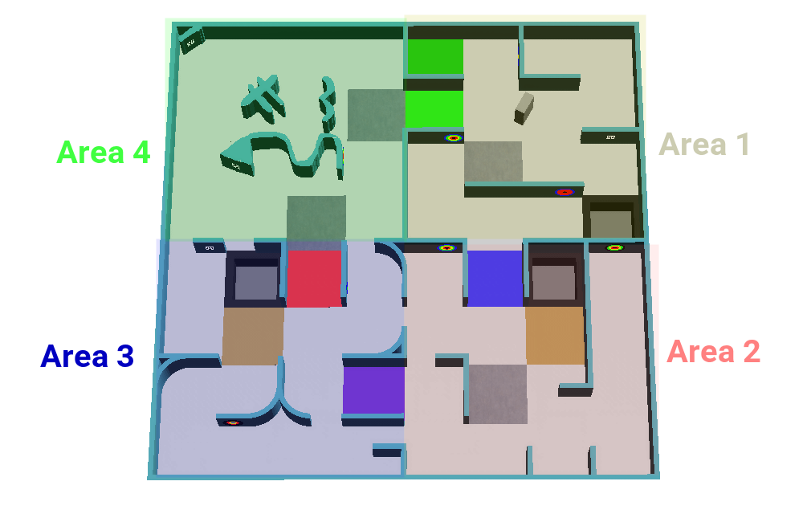
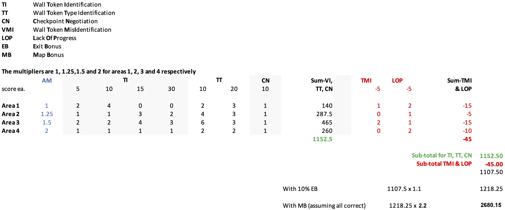

# Quick briefing

A fast, single-page overview of the whole Rules & Scoring section, field, tokens, scoring, and the
map, before you dive into the full lessons. Read this first if you want the shape of the thing before
the detail. Read the linked pages next for the parts that matter to your team's strategy.

!!! tip "How to use this page"
    Skim top to bottom once. Then go deep on whichever section your team is weakest on, using the
    links inline. Everything here is explained properly on
    [Understanding the field](rules-field.md) onward.

Running this as a class? See the [45–60 minute classroom workshop](workshop.md) guide instead, it
turns this same material into four timed, hands-on activities.

## The scenario

Your robot explores a maze **entirely on its own**, no remote control, no pre-loaded map. It searches
the walls for victims and hazmat signs, reports what it finds, and draws a map of the maze as it goes.
Gets stuck? No elimination, it's sent back to the last checkpoint and keeps going.

## The field: four areas, each one harder

| Area | What's different |
|---|---|
| 1 | Whole 12cm tiles, walls on tile edges only. |
| 2 | Quarter-tile precision. |
| 3 | Quarter-tile precision, corners can curve. |
| 4 | Optional. No grid at all, diagonal moves allowed, highest reward. |

Every pair of connected areas shares one color-coded passage tile, read the floor color and you know
exactly which two areas your robot just crossed between. No wall-hugging strategy reaches every tile
either: **linear tiles** are reachable by always following one wall, **floating tiles** aren't, and
floating tiles pay 3× more to find a token on. **Swamps** slow the clock (5× → 10× on repeat visits),
**obstacles** block a tile each, and **holes** end the run if your robot falls in.

Full version: [Understanding the field](rules-field.md).

## Wall tokens: what your robot is hunting for

**Letter victims** are three Greek letters, memorize them, don't try to match them by shape:

| Symbol | Status | Code |
|---|---|---|
| Φ | Harmed | H |
| Ψ | Stable | S |
| Ω | Unharmed | U |

**Cognitive targets** are 5-ring circles that decode to a hazmat type. Read the rings center outward,
convert each color to a number, and sum all five:

| Color | Value | | Sum | Hazmat |
|---|---|---|---|---|
| Black | −2 | | 0 | Flammable Gas [F] |
| Red | −1 | | 1 | Poison [P] |
| Yellow | 0 | | 2 | Corrosive [C] |
| Green | 1 | | 3 | Organic Peroxide [O] |
| Blue | 2 | | other | Fake, don't report it |

??? question "Quick check: Green, Blue, Yellow, Red, Yellow → ?"
    1 + 2 + 0 − 1 + 0 = **2** → **Corrosive [C]**

!!! warning "Some tokens are fakes"
    Tokens rendered with visible 3D depth instead of flat print are decoys. Reporting one costs you
    points, a real misidentification, not a shrug.

Full version, with more practice: [Victims and hazmats](rules-tokens.md).

## Scoring: where you find it changes what it's worth

| | Linear tile, Areas 1–3 | Floating tile / Area 4 |
|---|---|---|
| Letter victim — TI | 5 | **15** |
| Letter victim — TT (correct type) | +10 | +10 |
| Cognitive target — TI | 10 | **30** |
| Cognitive target — TT (correct type) | +20 | +20 |

Identification only counts if your robot's center is within **half a tile** of the token when it
reports. Checkpoints (CN) are +10 anywhere. Misidentifications (TMI) and Lack of Progress (LoP) are a
flat −5 each, everywhere, they don't scale with area the way TI/TT/CN do. Area multipliers are ×1,
×1.25, ×1.5, ×2 for Areas 1–4.

Two bonuses multiply your *entire* score, applied last:

- **Exit bonus:** +10%, if you identify at least one token and return to the start.
- **Mapping bonus:** up to **×2.2**, based on how accurate your submitted map is.

**One full worked example**, start to finish: 1152.5 (TI+TT+CN across 4 areas) − 45 (penalties) ×
1.1 (exit bonus) × 2.2 (mapping bonus) = **2680.15**.

Full version, walked through step by step: [How points are earned](rules-scoring.md).

## The map: worth up to 2.2×

Built at quarter-tile resolution, with a cell for every wall edge and corner too, so a single tile is
more than one matrix cell wide.

| Value | Means | | Value | Means |
|---|---|---|---|---|
| `0` | Nothing | | `4` | Checkpoint |
| `1` | Wall | | `5` | Starting tile |
| `2` | Hole | | `x` | Obstacle |
| `3` | Swamp | | `*` | All of Area 4 |

Full version, with a worked example: [Drawing the map](rules-map-format.md).

## Strategy: what actually moves the score

- Checkpoints are free points **and** your safety net, touch every one you pass.
- Floating tiles and Area 4 pay 3× on identification. Don't just hug walls.
- Don't re-enter the same swamp, the time penalty compounds each time.
- The exit bonus is a free +10% if you can make it back. Budget time for it.
- A decent map is worth up to ×2.2, it can matter more than any single token.

## What's next

- Go deep, page by page: [Understanding the field](rules-field.md) → [Victims and hazmats](rules-tokens.md)
  → [How points are earned](rules-scoring.md) → [Drawing the map](rules-map-format.md).
- Test yourself: [Rules self-check](rules-quiz.md).
- Print something: [Scoring cheat sheet](scoring-cheat-sheet.md),
  [Cognitive target decoder](cognitive-target-decoder.md).
- Read it word for word: [Official rules (reference)](official-rules-2026.md).

Source for every figure and number on this page: the official RoboCupJunior Rescue Simulation Rules
2026. Last updated 2026-02-11.
