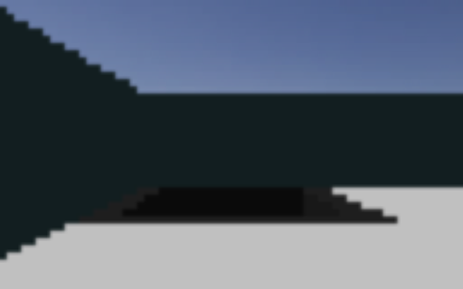

# Turning on the camera

Every previous page read a sensor that returns a small handful of numbers. This page reads the
robot's main camera, which returns a whole image, thousands of numbers at once. It's the first step
toward the robot recognising a victim sign rather than just avoiding walls. It takes about 15
minutes.

!!! note "What you're building"
    A controller that enables the camera, prints its real resolution, and saves one real frame to a
    picture file so you can see exactly what the robot sees.

---

## Step 1: A camera is a much bigger sensor

`camera_centre` is a device like any other, `robot.getDevice("camera_centre")` then
`.enable(timeStep)`. Once it's enabled, `.getImage()` returns a raw byte buffer, and
`.getWidth()` / `.getHeight()` tell you its resolution. Like
[the floor colour sensor](code-colour.md), which is really a tiny camera too, the bytes are in
**BGRA** order: blue, green, red, alpha, four bytes per pixel, row by row.

The buffer length should always equal `width * height * 4`. That's a useful sanity check if you
ever get a shape or size error later when processing the image.

---

## Step 2: Write the controller

```python
from controller import Robot

timeStep = 32
robot = Robot()

camera = robot.getDevice("camera_centre")
camera.enable(timeStep)

wheel1 = robot.getDevice("wheel1 motor")
wheel2 = robot.getDevice("wheel2 motor")
wheel1.setPosition(float("inf"))
wheel2.setPosition(float("inf"))

step = 0
printed_info = False

while robot.step(timeStep) != -1:
    step += 1
    wheel1.setVelocity(2.0)
    wheel2.setVelocity(2.0)
    image = camera.getImage()
    width = camera.getWidth()
    height = camera.getHeight()

    if not printed_info:
        print(f"CAMERA INFO width={width} height={height} "
              f"fov={camera.getFov():.4f} image_bytes={len(image)}")
        printed_info = True
```

We added a slow forward drive so the camera actually sees something changing, a camera pointed at a
completely static scene is a boring first test.

---

## Step 3: Load it and check the numbers

1. In Webots, press **reset**, then **LOAD** your saved file.
2. Press **start**.

!!! success "You should now see"
    One line printed near the start of the run. On a real run:

    ```
    CAMERA INFO width=64 height=40 fov=1.0000 image_bytes=10240
    ```

    Check the arithmetic yourself: `64 * 40 * 4 = 10240`. It matches, confirming the BGRA,
    4-bytes-per-pixel layout.

### What the camera actually sees

We went one step further than printing numbers: we decoded a real frame's raw bytes into an actual
picture, byte for byte, no screenshot tool involved, just reading `camera_centre`'s own buffer and
writing it out as an image.



*Decoded directly from `camera.getImage()` on a real run, not a screenshot of the Webots window.
The dark shape is a wall close in front of the robot; the lighter band above it is the simulated
sky. `camera_centre` is a low resolution, wide field-of-view sensor, this blocky look is really
what 64×40 pixels looks like, not a rendering problem.*

---

## Now make it your own

- Change `camera.enable(timeStep)` to enable it once every few steps instead (call `.enable()` with
  a bigger number) and watch `image_bytes` stay exactly the same, resolution doesn't change, only
  how often you get a fresh frame.
- Print the value of just one pixel, say the very centre one, at `image[(height // 2 * width +
  width // 2) * 4]` for its blue byte. Watch it change as the robot drives toward the wall.
- Try `camera.getFov()` after changing nothing, then compare it with the `fieldOfView` field in
  `custom_robot.proto`, they should match.

Next in this series: spotting a victim sign in this same camera image.

---

## If it goes wrong

- **`camera.getImage()` returns `None`.** You called it before enabling the camera, or before the
  first `robot.step()` call has run. Enable first, then only call `getImage()` inside the loop.
- **`len(image)` doesn't match `width * height * 4`.** Something's reading a stale buffer or the
  wrong device. Print `camera.getWidth()` and `camera.getHeight()` right next to `len(image)` to
  make sure they're all coming from the same call.
- **Decoding the image into a picture yourself produces a solid grey or black square.** Double
  check the byte order. It's BGRA, if you write it out assuming RGBA you'll get a colour-shifted or
  washed-out result, not a clean error, which makes this an easy mistake to miss.

---

Next: spotting a victim sign (coming soon).
