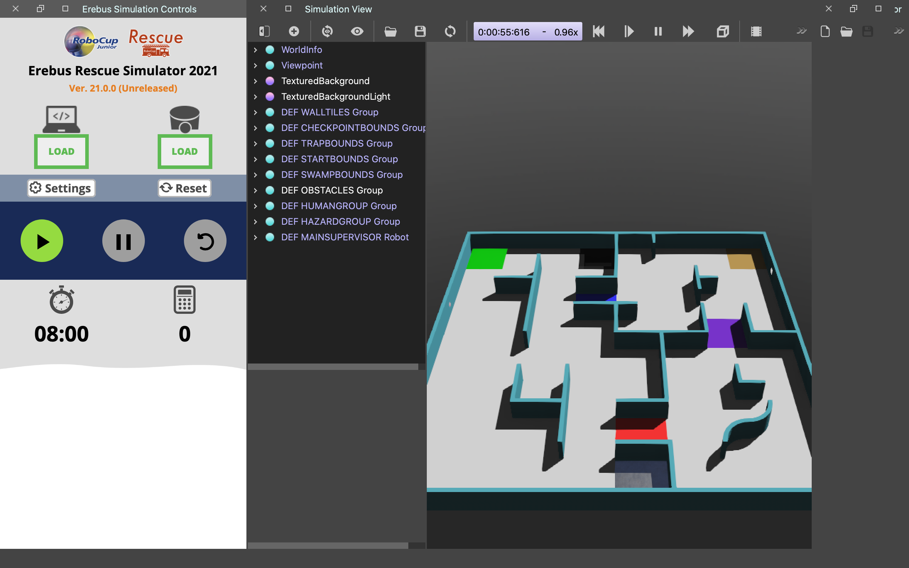
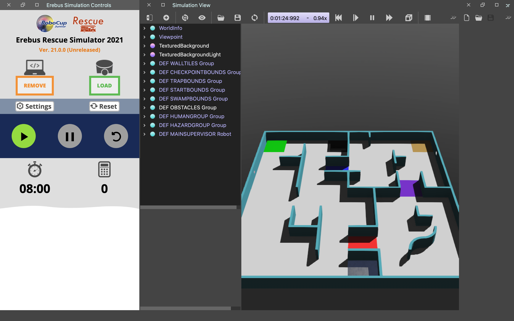
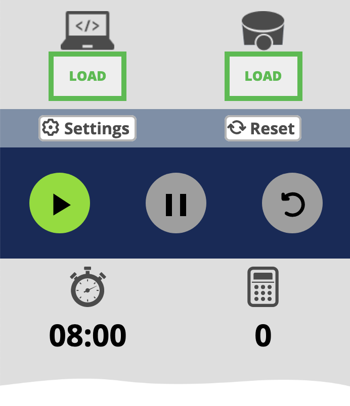
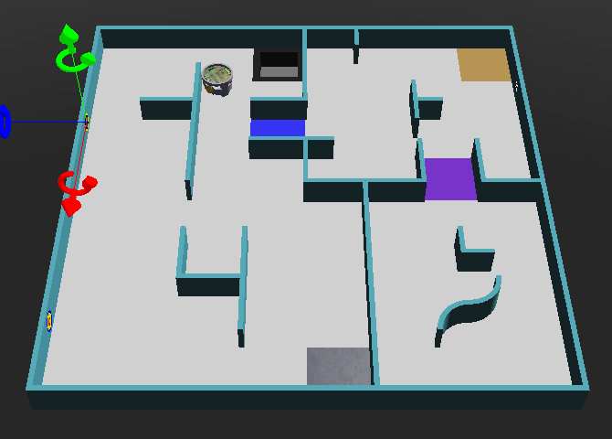
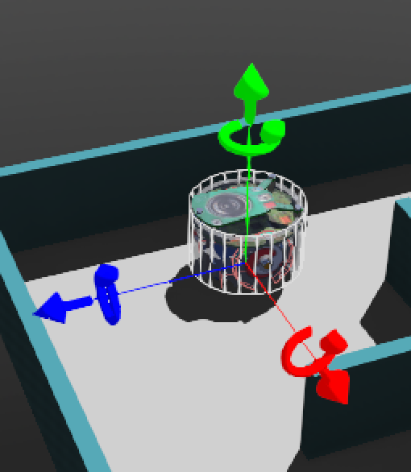

# Your first run

You've installed everything ([Windows](install-windows.md) · [macOS](install-mac.md) ·
[Linux](install-linux.md)). Now you'll load the sample robot brain and watch the robot drive around
the maze by itself. This takes about 5 minutes.

!!! note "What you'll see by the end"
    The e-puck robot appears in the maze and drives forward on its own, slowing and turning when it
    gets near a wall. That's the sample code thinking for it — code you'll edit yourself on the next
    page.

---

## Step 1 — Open the maze world

1. In your Erebus folder, open **`game/worlds`** and **double-click `world1.wbt`**. It opens in
   Webots.
2. On the **left** you'll see the **Competition Controller** panel (the referee — it runs the clock
   and score).

!!! success "You should now see"
    The maze in the middle of the screen and the Competition Controller panel on the left. If the
    left panel is missing, see [When it goes wrong](troubleshooting.md#4-the-competition-supervisor-panel-doesnt-appear).

---

## Step 2 — Load the sample robot code

The robot needs a **controller** — the Python file that acts as its brain. Erebus comes with a
sample one.

1. In the Competition Controller panel, click the **LOAD** button (top band).

    

    *Screenshot: RoboCupJunior Erebus documentation, Apache-2.0.*

2. A file picker opens. Go into the **`player_controllers`** folder and choose
   **`ExamplePlayerController_updated.py`**.

!!! success "You should now see"
    The **LOAD button turns orange** — that means the code is loaded and ready.

    

    *Screenshot: RoboCupJunior Erebus documentation, Apache-2.0.*

---

## Step 3 — Press play and watch it drive

The Competition Controller has three round buttons. The left one starts the match.

*Screenshot: RoboCupJunior Erebus documentation, Apache-2.0.*

1. Press the **start** (play) button.

    

    *Screenshot: RoboCupJunior Erebus documentation, Apache-2.0.*

2. The robot appears in the maze and **starts driving forward on its own**. When it gets close to a
   wall, the sample code slows one wheel so it turns away.

!!! note "First time only: a short wait"
    The very first time, Webots may show **"Initializing…"** while it sets up the Python libraries
    the simulator needs. Give it a minute or two. If it never finishes, or you see an error about a
    missing module, see [When it goes wrong](troubleshooting.md#3-its-stuck-on-initializing).

!!! success "You did it! ✅ — verified on a real run"
    The robot drives around the start area by itself, turning away from walls. *(We confirmed this
    end-to-end: with the sample controller loaded, the robot really does spawn and drive with
    obstacle-avoidance — that's exactly what you should see.)*

*A real screenshot from our run: the robot (round object, upper area) in the `world1` maze.*

---

## The other buttons

- **Pause** — freezes the match so you can look around. Press start again to continue.

    

- **Reset** (and the gear next to it for debug options) — clears the run so you can start over.

    

    *Screenshots: RoboCupJunior Erebus documentation, Apache-2.0.*

## Move the robot by hand

Click the robot in the maze and coloured arrows appear. **Drag an arrow** to slide the robot to a
new spot. (The robot only shows up once you've pressed start.)

*Screenshot: RoboCupJunior Erebus documentation, Apache-2.0.*

---

## If it goes wrong

- **No left-side panel** → [Supervisor didn't appear](troubleshooting.md#4-the-competition-supervisor-panel-doesnt-appear).
- **Pressed LOAD but the robot won't move** → the controller may not have loaded, or Python isn't
  set up — see [Can't load a controller](troubleshooting.md#6-cant-load-a-controller).
- **Stuck on "Initializing…"** → [It's stuck on Initializing](troubleshooting.md#3-its-stuck-on-initializing).

---

Next: **[Make it move](make-it-move.md)** — change one number in the robot's code and watch it drive
differently. Your first real taste of programming the robot.
