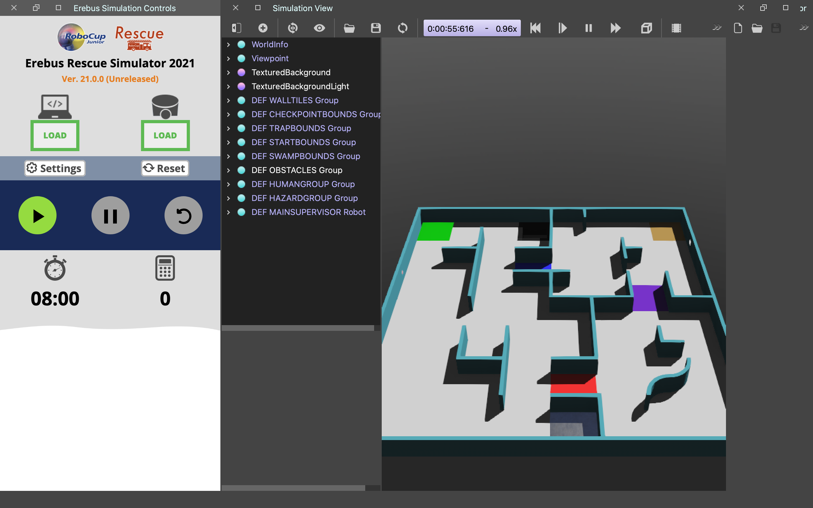
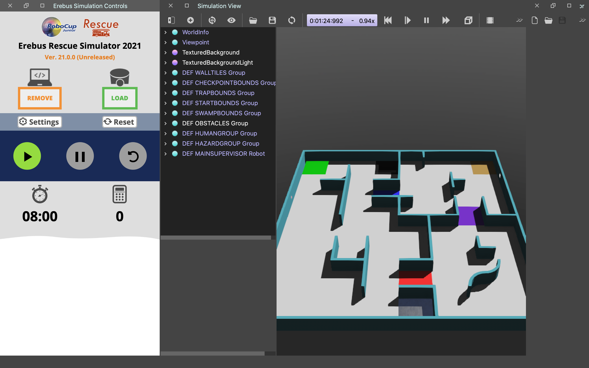
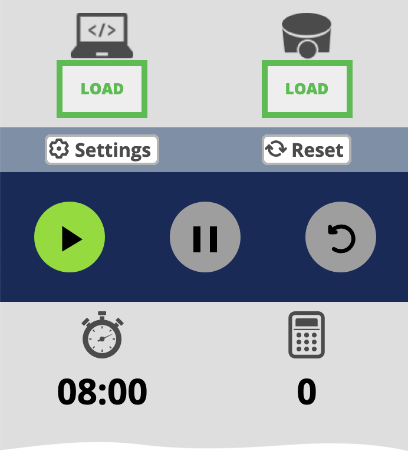
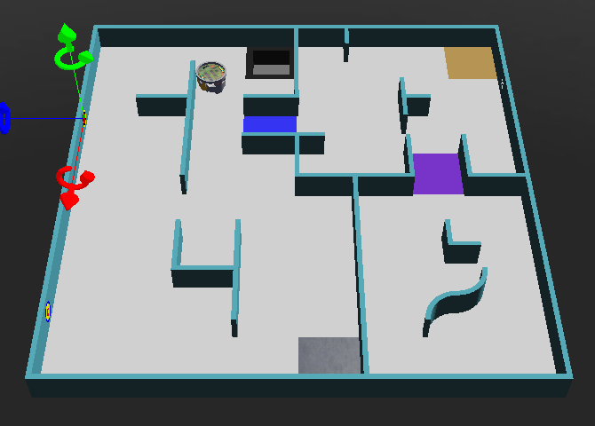
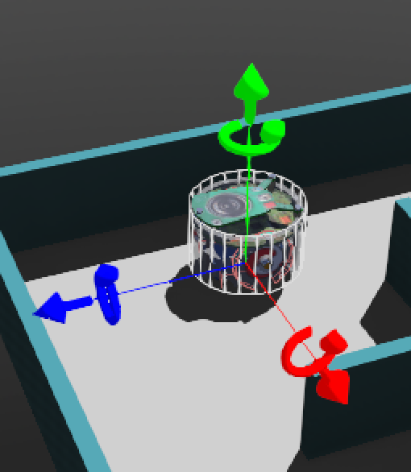

# Your first run

Installation is complete ([Windows](install-windows.md), [macOS](install-mac.md), or
[Linux](install-linux.md)). This section verifies simulator
functionality prior to any code modification: you will load the sample robot controller and
observe the robot navigate the maze autonomously. Estimated duration: 5 minutes.

## Expected output

The e-puck robot appears in the maze and moves forward autonomously, decelerating and turning when
approaching walls. This behaviour is governed by the sample controller code.

On initial launch, Webots displays **"Initializing…"** while installing required Python library
dependencies for the simulator. Allow one to two minutes for completion. If the process fails to
complete, or a missing module error occurs, see
[When it goes wrong](troubleshooting.md#3-its-stuck-on-initializing).

The robot navigates the start area autonomously, turning to avoid walls. This behaviour was
verified directly: with the sample controller loaded, the robot spawns and moves through the area,
avoiding obstacles as expected.

---

## Step 1: Open the maze world

1. In your Erebus folder, open **`game/worlds`** and **double-click `world1.wbt`**. It opens in
   Webots.
2. On the **left** you'll see the **Competition Controller** panel. That's the referee, and it runs
   the clock and the score.

!!! success "You should now see"
    The maze in the middle of the screen and the Competition Controller panel on the left. If the
    left panel is missing, see [When it goes wrong](troubleshooting.md#4-the-competition-supervisor-panel-doesnt-appear).

---

## Step 2: Load the sample robot code

The robot needs a **controller**, the Python file that acts as its brain. Erebus comes with a sample
one, meaning you can test the setup without writing anything yet.

1. In the Competition Controller panel, click the **LOAD** button (top band).

    

2. A file picker opens. Go into the **`player_controllers`** folder and choose
   **`ExamplePlayerController_updated.py`**.

!!! success "You should now see"
    The **LOAD button turns orange**, which means the code is loaded and ready.

    

---

## Step 3: Press play and watch it drive

The Competition Controller has three round buttons. The left one starts the match, while the
others pause and reset it.

1. Press the **start** (play) button.

    

2. The robot appears in the maze and **starts driving forward on its own**. When it gets close to a
   wall, the sample code slows one wheel so the robot turns away.

---

## The other buttons

Additionally, the controller gives you two more controls:

- **Pause** freezes the match so you can look around. Press start again to continue.

    

- **Reset** (and the gear next to it for debug options) clears the run so you can start over.

    

## Move the robot by hand

To reposition the robot without restarting, click it in the maze and coloured arrows appear. Drag
an arrow to slide the robot to a new spot. (The robot only shows up once you've pressed start.)

---

## If it goes wrong

- **No left-side panel.** See [Supervisor didn't appear](troubleshooting.md#4-the-competition-supervisor-panel-doesnt-appear).
- **You pressed LOAD but the robot won't move.** The controller may not have loaded, or Python isn't
  set up. See [Can't load a controller](troubleshooting.md#6-cant-load-a-controller).
- **Stuck on "Initializing…"** See [It's stuck on Initializing](troubleshooting.md#3-its-stuck-on-initializing).

---

Next up: **[Make it move](make-it-move.md)**. You'll change one number in the robot's code and watch
it drive differently, which is your first real taste of programming the robot.
