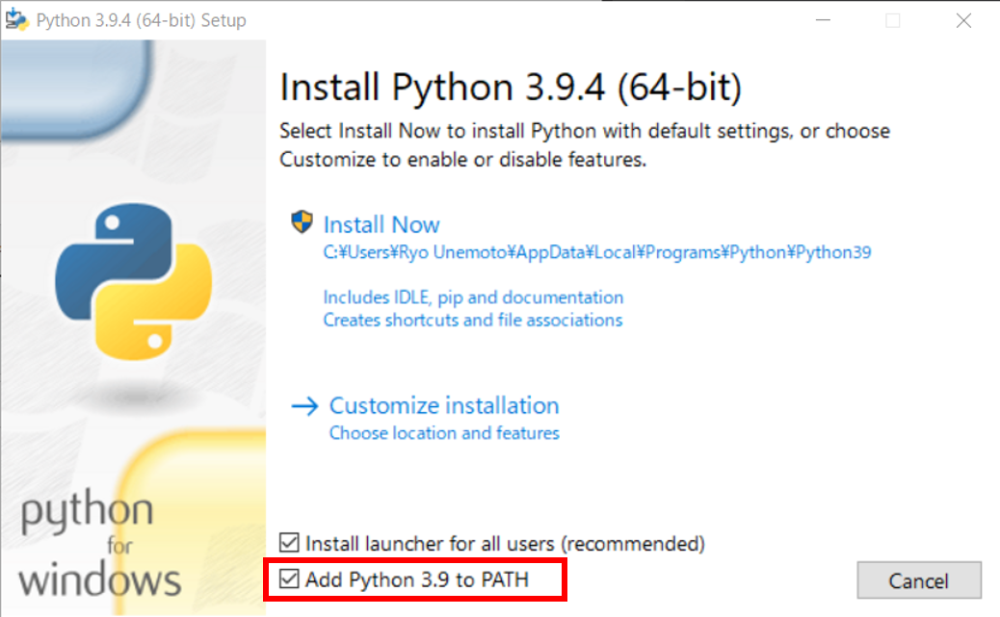
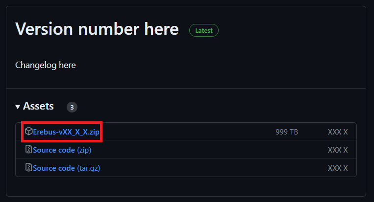

# Install on Windows

!!! tip "Before you begin"
    If you haven't read [Before you start](before-you-start.md), do that first. It explains what
    these three pieces (Python, Webots, Erebus) are. Every unfamiliar word is in the
    [Glossary](glossary.md).

---

## Step 1: Install Python

Python is the language your robot's instructions are written in.

1. Go to the official Python download page: **<https://www.python.org/downloads/windows/>**.
2. Download **Python 3.10.11** (the last 3.10 version with a Windows installer). Click the
   **"Windows installer (64-bit)"** link. *(Python 3.9.x also works. However, this guide uses
   3.10.)*
3. Open the file you just downloaded. It's called something like `python-3.10.11-amd64.exe`.
4. On the very first screen of the installer, tick the box at the bottom that says
   "Add python.exe to PATH."

    

5. Click **"Install Now"** and wait for it to finish. Click **Close** at the end.

!!! info "What is PATH?"
    PATH is the list of locations your computer searches when a program is called by name. Enabling
    that option adds Python to this list, allowing Webots to launch it automatically. See the
    [glossary](glossary.md#setup-words) for more detail.

!!! success "You should now have"
    Python installed. To check, press <kbd>Win</kbd>, type **cmd**, and open **Command Prompt**.
    Type `python --version` and press <kbd>Enter</kbd>. You should see `Python 3.10.11`. If you see
    an error instead, or the Microsoft Store opens, then PATH wasn't set. Head to
    [When it goes wrong](troubleshooting.md).

---

## Step 2: Install Webots

Webots is the simulation environment in which the maze and robot are rendered.

1. Download the exact version required by Erebus directly from this link:
   **[webots-R2023b_setup.exe](https://github.com/cyberbotics/webots/releases/download/R2023b/webots-R2023b_setup.exe)**.
   The file is approximately 1 GB, so the download may take some time.

    !!! warning "Use R2023b, not the newest Webots"
        A newer Webots will give confusing errors with Erebus. Therefore, install **exactly
        R2023b** — the link above already points to the right one.

2. Open the downloaded file and click through the installer, leaving every option at its default.
3. Wait for it to finish, then click **Finish**.

!!! success "You should now have"
    Webots installed. Open it once from the Start menu, and it should open to a 3D window. You can
    close it again. The next step opens it properly.

---

## Step 3: Download the Erebus files

Erebus is the competition package: the maze worlds, the sample robot, and the scoring referee. It
isn't an installer. It's a folder of files you unzip.

1. Go to the latest release page: **<https://github.com/robocup-junior/erebus/releases/latest>**.
2. Under **"Assets"**, click **"Source code (zip)"** to download it.

    !!! warning "There's no 'Release Build' file. Use 'Source code (zip)' instead."
        Older guides reference downloading a "Release Build," but as of v26.1, Erebus releases no
        longer include one. Use "Source code (zip)."

    

3. Find the downloaded `.zip` in your Downloads folder. **Right-click it, choose "Extract All…",
   then Extract.** Pick somewhere easy to find, like `Documents\Erebus`.

    !!! warning
        If you double-click a `.zip`, Windows only previews it. Running Erebus from inside that
        preview causes a blank or black Webots screen. Use **Extract All** so you get a real folder
        first.

!!! success "You should now have"
    A folder (for example `Documents\Erebus\erebus-26.1`) containing folders named `game`,
    `player_controllers`, and others.

---

## Step 4: Open it and check it works

1. In your extracted Erebus folder, go into **`game\worlds`**.
2. **Double-click `world1.wbt`.** It opens in Webots, and the Competition Supervisor panel appears
   on the left.
3. The first time only, Webots installs some Python libraries automatically. You'll see
   **"Initializing…"**.

    !!! note "\"Initializing…\" can take a few minutes"
        It is installing Python libraries in the background; this is expected behaviour, not a hang.
        Allow a couple of minutes for the process to complete. If it does not finish, see
        [When it goes wrong](troubleshooting.md#3-its-stuck-on-initializing).

!!! success "You should now have"
    When the maze is on screen and the Competition Controller panel shows a time limit, Windows
    setup is done. Continue to **[Your first run](first-run.md)** to load the robot and watch it
    move.

---

## If it goes wrong

- **You typed `python` and nothing happened, or the Store opened.** PATH wasn't set in Step 1.
- **The Webots screen is blank or black.** You opened Erebus from inside the zip. Extract All first.
- **"Initializing…" never ends, or you see `No module named 'cv2'`.** Open Command Prompt and run
  `python -m pip install numpy termcolor requests opencv-python pillow overrides`, then reopen the
  world. (The simulator needs more than the three libraries the official docs list.)
- **The Supervisor panel didn't appear.** The fix is in [When it goes wrong](troubleshooting.md#4-the-competition-supervisor-panel-doesnt-appear).

Full, searchable help is on the **[When it goes wrong](troubleshooting.md)** page.
