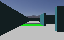

# The eight practice worlds and what each is for

Erebus ships eight ready-made worlds. This page opens all eight, reports what's really in each one
(parsed straight from the world files, not guessed), and gives one honest line on what to practise
in each.

!!! note "About the images on this page"
    A full top-down screenshot of each maze would be more useful than what's here, but this
    session's machine has no working macOS Screen Recording permission for this automation (a real,
    confirmed limitation, `screencapture` itself returns a solid black image system-wide here, not
    a Webots-specific problem). Rather than fake a screenshot, each world below gets a real image
    instead: one frame decoded directly from the robot's own `camera_centre` at its start position,
    [the same honest technique used for the camera and victim-detection pages](code-camera.md). It's
    a small, low-resolution corridor view, not a map, treat the table underneath each one as the
    real substance.

---

## world1

{ width=192 }

The world every Track C page on this site was built and trialled against.

| | |
|---|---|
| Tiles | 37 |
| Victims | 3 (harmed, unharmed, stable, one each) |
| Cognitive targets | 2 |
| Swamp / checkpoint / trap tiles | 0 / 1 / 1 |
| Areas present | 1, 2, 3 |

**Practise here:** everything Track C already covers, [sensors](code-sensors.md) through
[a complete run](code-complete-run.md). [The wall-follower](code-wall-follower.md) and [the
complete-run page](code-complete-run.md) both found real coverage limits on this exact maze, it's a
good honest baseline for testing whether your own navigation beats what this site's did.

## world2

{ width=192 }

| | |
|---|---|
| Tiles | 27 |
| Victims | 5 (unharmed ×2, stable ×2, harmed ×1) |
| Cognitive targets | 3 |
| Swamp / checkpoint / trap tiles | 1 / 1 / 2 |
| Areas present | 1, 2, 3, 4 |

**Practise here:** the most victim-dense of the four full-size worlds, and the only one of the two
this site used with a real trap tile count above one. Good for testing misidentification handling
under higher token density, more chances to get one wrong per minute of play than `world1`.

## world3

{ width=192 }

| | |
|---|---|
| Tiles | 25 |
| Victims | 6 (harmed ×4, unharmed ×2) |
| Cognitive targets | 4 |
| Swamp / checkpoint / trap tiles | 1 / 1 / 2 |
| Areas present | 1, 2, 3 |

**Practise here:** the most victims of any world here, on the smallest full-size tile count. Good
for testing reporting throughput, how many correct identifications can your controller actually get
through before the clock runs out, [per the run-budget page's own findings](strategy-run-budget.md).

## world4

{ width=192 }

| | |
|---|---|
| Tiles | 60 (largest world here) |
| Victims | 2 |
| Cognitive targets | 4 |
| Swamp / checkpoint / trap tiles | 1 / 3 / 0 |
| Areas present | 1, 2, 3, 4 |

**Practise here:** the biggest maze and the most checkpoints of any world on this list, with zero
trap tiles, so Lack of Progress here comes almost entirely from getting physically stuck, not from
falling in a hole. Good for testing pure exploration coverage over a longer, more open run.

## NewPassages

{ width=192 }

| | |
|---|---|
| Tiles | 28 |
| Victims | 0 |
| Cognitive targets | 0 |
| Swamp / checkpoint / trap tiles | 0 / 0 / 0 |
| Areas present | 1, 2, 3, 4 |

**Practise here:** no tokens at all, real and worth knowing before you load it expecting to score.
This is a pure navigation and mapping world, [the map matrix's official sample
controller](code-mapping.md) actually ships its own ready-made test matrix for this exact world (see
that page's notes), making it a good place to practise map building and submission without any
detection code in the way.

## mapping_example_1

{ width=192 }

| | |
|---|---|
| Tiles | 16 (compact) |
| Victims | 3 (one of each type) |
| Cognitive targets | 5 |
| Swamp / checkpoint / trap tiles | 1 / 2 / 1 |
| Areas present | 1 only |

**Practise here:** already used on this site, [reading the floor colour sensor](code-colour.md)
picked this world specifically because its swamp, checkpoint, and hole all sit within a few tiles
of spawn, [confirmed there](code-colour.md). The smallest, fastest world to iterate on if you're
still debugging basic sensor code rather than trying to cover ground.

## mapping_example_2

{ width=192 }

| | |
|---|---|
| Tiles | 4 (the smallest world here, by far) |
| Victims | 2 |
| Cognitive targets | 3 |
| Swamp / checkpoint / trap tiles | 0 / 0 / 0 |
| Areas present | 1, 2 |

**Practise here:** small enough to fully explore in well under a minute even with a mediocre
wall-follower, a good place to test a complete detect-report-exit pipeline end to end without
[the coverage problems Track C ran into on the bigger worlds](code-complete-run.md) getting in the
way first.

## mapping_example_3

{ width=192 }

| | |
|---|---|
| Tiles | 10 |
| Victims | 4 (harmed ×2, stable, unharmed) |
| Cognitive targets | 5 |
| Swamp / checkpoint / trap tiles | 0 / 1 / 0 |
| Areas present | 1, 2, 3, 4 |

**Practise here:** small like the other `mapping_example` worlds, but the only one of the three with
all four areas present, useful for testing area-multiplier handling ([confirmed real and
non-obvious on the scoring maths page](strategy-scoring-maths.md)) without needing a full-size
maze's worth of exploration time to reach them.

---

## Now pick deliberately, not by habit

- If your team always practises on the same one or two worlds, this table is worth a second look,
  several of these have real, structural differences (trap count, area spread, token density) that
  change what a run on them is actually testing.
- The three `mapping_example` worlds are small enough to run many times per practice session. If
  your team is iterating on core logic rather than testing endurance, they're a faster loop than the
  four full-size worlds.

---

## If it goes wrong

- **A `mapping_example` world "feels too easy" and gives a false sense of readiness.** That's a real
  risk with small worlds, they're good for iterating on logic, not for judging whether your
  exploration coverage is good enough for a full-size maze.
- **You expected tokens on `NewPassages` and found none.** Confirmed on this page: that world has
  zero victims and zero cognitive targets by design.

---

Next: the debugging playbook (coming soon).
