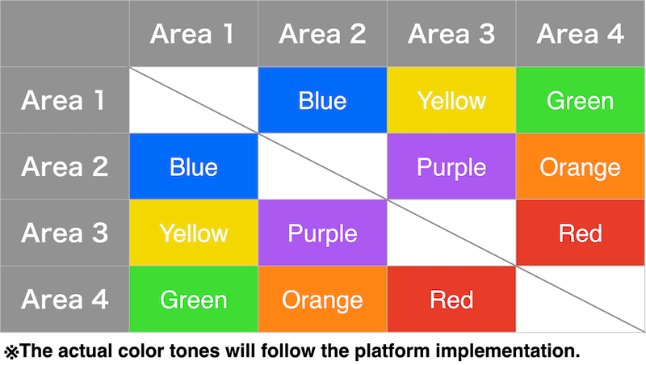
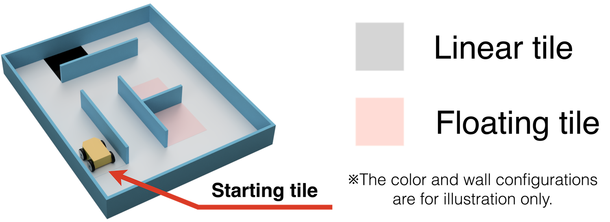
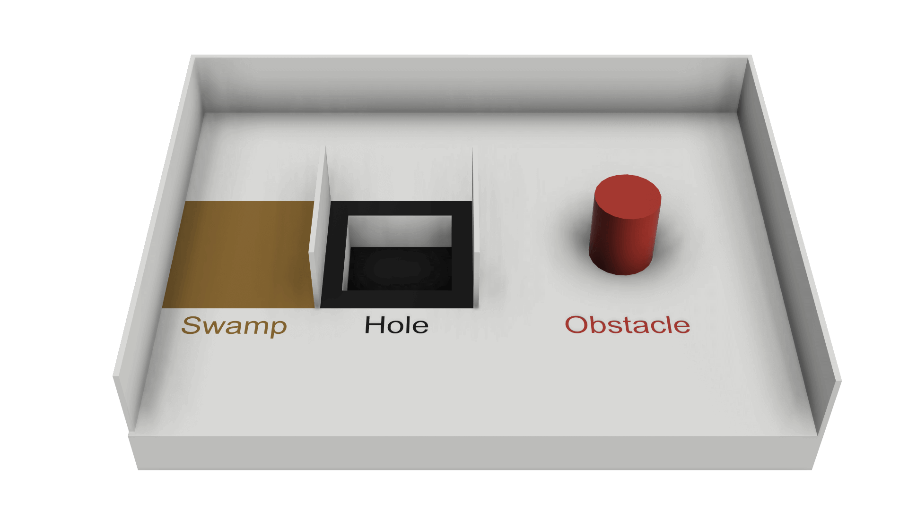

# Understanding the field

Before your robot can search for victims, it helps to understand the world it's searching. This page
covers the maze itself: the four areas, the tiles it's built from, and the hazards scattered through
it. Nothing here is code. It's the map in your head that the code you'll eventually write is trying to
build.

!!! note "Where this fits"
    This is the first of five short pages that turn the [official rules](official-rules-2026.md) into
    something you can actually study from. Next up: [Victims and hazmats](rules-tokens.md).

## The scenario, in one paragraph

Somewhere hazardous, a set of "wall tokens" mark where victims and hazardous chemicals are. Your
robot's job is to explore the maze on its own (no remote control, no pre-loaded map of where anything
is), find those tokens, and report them, while also drawing a map of the maze as it goes. If it gets
stuck, it doesn't fail; it gets sent back to the last checkpoint it reached and tries again.

## The four areas

The field is split into four areas, each a little harder to navigate than the last. They're laid out
around a shared perimeter and connected to each other by short, color-coded one-tile passages.

*Figure: official RoboCupJunior Rescue Simulation Rules 2026.*

- **Area 1** is the simplest: walls only meet at the edges of full 12 cm × 12 cm tiles.
- **Area 2** and **Area 3** use quarter-tiles instead: each 12 cm tile is split into four 6 cm × 6 cm
  squares, and walls can sit on *those* edges too, so the maze gets more intricate. Area 3 can also
  round a 90° corner into a curve.
- **Area 4** (optional, and worth the most) throws the grid away entirely. Walls and objects (boxes,
  for example) are placed arbitrarily, not on any tile system, and your robot may need to move at
  angles that aren't simply north/east/south/west.

Every pair of areas that connects is joined by exactly one passage tile, walled on two sides so it has
a clear entrance and exit, and painted a specific color:

*Figure: official RoboCupJunior Rescue Simulation Rules 2026. Exact color tones depend on the platform.*

That means if your robot's floor-color sensor reads "blue," you immediately know it just crossed
between Area 1 and Area 2, no matter where in the maze that happened.

## Linear tiles vs. floating tiles

One tile in Area 1 is the **starting tile**, where your robot begins. From there, some tiles are
reachable just by always turning the same direction, e.g. "always follow the wall on my left." The
rules call those **linear tiles**. Tiles you can't reach that way, ones that need you to let go of the
wall and cross open space, are **floating tiles**.

*Figure: official RoboCupJunior Rescue Simulation Rules 2026.*

This distinction matters later: floating tiles are considered harder to reach, so wall tokens found on
them score more. (More on that in [How points are earned](rules-scoring.md).) It's also a strategy
hint: a robot that only knows how to hug a wall will always miss the floating tiles.

## Checkpoints

Silver tiles are **checkpoints**. They can show up anywhere on the field, and Area 4 always has one
right after its entrance passage. Reaching one is worth points on its own, and, just as importantly,
it's your robot's fallback position: if it gets stuck later, it's sent back to the last checkpoint it
touched, not all the way to the start.

## Swamps, obstacles, and holes

Three more things can appear anywhere in the maze:

*Figure: official RoboCupJunior Rescue Simulation Rules 2026.*

- **Swamps** (brown) don't block the robot, they slow down *time* instead. The clock runs 5× faster
  than normal the first time your robot is in a given swamp. Go back into that same swamp again later,
  and it gets worse: 6× faster, then 7×, up to a cap of 10×. Swamps are a reason to avoid backtracking
  through ones you've already crossed.
- **Obstacles** are solid shapes (boxes, cylinders, spheres, pyramids) fixed to the floor. There's never
  more than one on a single tile, and its center is always placed on a tile, not straddling the line
  between two. Your robot has to steer around it.
- **Holes** are exactly what they sound like: a black-edged gap in the floor your robot must not drive
  into. Falling in one triggers a Lack of Progress (see [How points are earned](rules-scoring.md)).

## Check yourself

??? question "Your robot's color sensor reads yellow under it. What does that tell you?"
    Checking the passage-color table above: yellow connects Area 1 and Area 3. Your robot just crossed
    directly between those two areas.

??? question "Why would a robot that only ever 'follows the left wall' fail to find every victim?"
    That strategy only ever reaches linear tiles, by definition. Floating tiles require crossing open
    space, so a wall-hugging robot will never visit them, and any wall tokens placed there.

## What's next

You now know what the maze is made of. Next: what your robot is actually looking for on the walls, and
how to decode the trickiest symbol in the whole competition: [Victims and hazmats](rules-tokens.md).

Unfamiliar word? Check the [glossary](glossary.md#rules-scoring-words).
