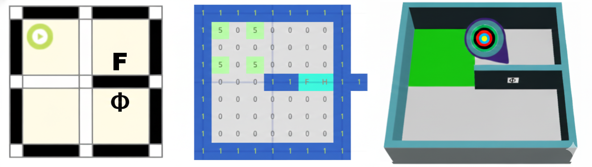
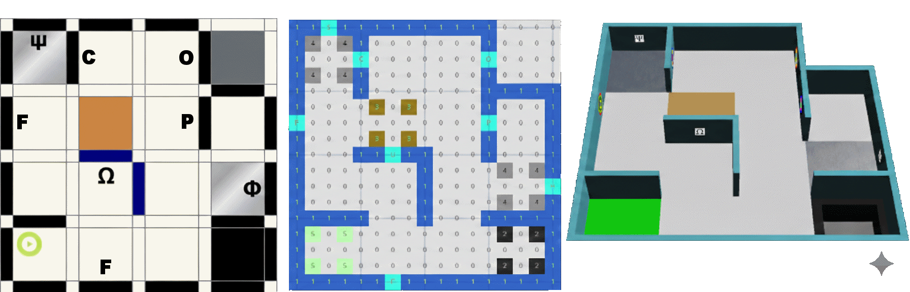
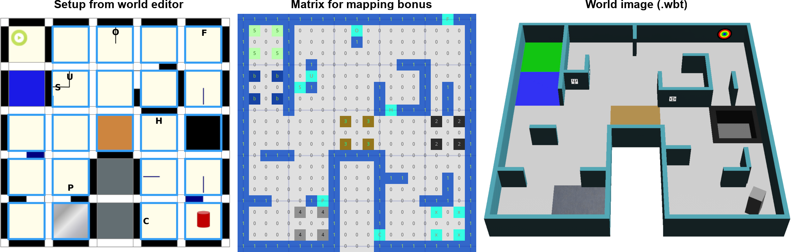

# Drawing the map: the mapping bonus

To stop this from tripping you up in code later, this page is entirely about building the matrix by
hand once, slowly, before you ever have to automate it. At any point during a run, your robot can
submit a matrix describing the maze it has explored — walls, holes, swamps, checkpoints, tokens, and
all — and getting it right multiplies your entire score by up to 2.2×. This is the fiddliest part of
the rules to read cold.

!!! note "Where this fits"
    Fourth of five pages building on the [official rules](official-rules-2026.md). Previous:
    [How points are earned](rules-scoring.md). Next: [Rules self-check](rules-quiz.md).

## The resolution: quarter-tiles, not tiles

Even in Area 1, the map matrix is built at **quarter-tile** resolution: every 12 cm tile is treated as
a 2×2 block of quarter-tiles. On top of that, the matrix also has a cell for every **edge** between
quarter-tiles (where a wall might be) and every **vertex** where edges meet (corners). That's why the
matrix always looks a lot bigger than the maze it describes: a simple 1×1 tile needs a 3×3 block of
cells just by itself (2 quarter-tile centres... plus the edge and vertex cells around them, in each
direction).

If you've ever seen a "maze as a grid of odd and even coordinates" representation before, this is
exactly that idea: cells at odd row/column positions are quarter-tile centres, cells at even
positions are the edges and vertices between them.

## The legend

| Value | Means |
|---|---|
| `0` | Nothing here (empty edge, empty vertex, or empty quarter-tile) |
| `1` | A wall |
| `2` | A hole |
| `3` | A swamp |
| `4` | A checkpoint |
| `5` | The starting tile |
| `x` | A tile with an obstacle on it |
| `b` | Passage, Area 1 ↔ Area 2 |
| `y` | Passage, Area 1 ↔ Area 3 |
| `g` | Passage, Area 1 ↔ Area 4 |
| `p` | Passage, Area 2 ↔ Area 3 |
| `o` | Passage, Area 2 ↔ Area 4 |
| `r` | Passage, Area 3 ↔ Area 4 |
| `H`, `S`, `U`, `F`, `P`, `C`, `O` | A wall token, using its own code (see [Victims and hazmats](rules-tokens.md)) |
| `*` | Any part of Area 4 (it isn't tile-based, so it's all filled in with `*`, border included) |

A few extra rules worth remembering:

- A single tile is never two of: swamp, hole, checkpoint, starting tile, obstacle tile, or passage, at
  once.
- If two wall tokens land on the same wall segment, their codes are written together in one cell (e.g.
  a cell reading `FH`), ordered top-to-bottom then left-to-right by their real position.
- For curved Area 3 walls, the vertex cell is just `0`.
- Correctness is checked against the real map for every 90° rotation of what you submitted, and the
  best-matching rotation is used, so you don't need to worry about which way is "up."

## Worked example: the smallest possible map

This is the simplest case in the rules: a single starting tile, with two wall tokens on the passage
tile next to it.

*Figure: official RoboCupJunior Rescue Simulation Rules 2026.*

Reading the three panels left to right:

1. **Setup from world editor** (left panel) shows the actual tile: the robot's start icon in the
   top-left quarter, a cognitive target token `F` (Flammable Gas) on one wall, and a letter victim
   `Φ` (harmed, code `H`) on another wall.
2. **Matrix for mapping bonus** (middle panel) is that same tile, encoded. Notice the block of four
   `5` cells: that's the starting tile, one `5` for each of its four quarter-tiles. The `0` cells
   between and around them mean no walls inside or around the starting tile itself. To the right,
   you can see the passage cells: `1` cells (walls) sandwiching `F` and `H` cells, exactly the two
   tokens from the setup panel, each in the matrix cell matching the wall it's actually on.
3. **World image** (right panel) is what that tile looks like rendered in Webots, for comparison.

The pattern to hold onto: **wherever a token appears in real life, its code goes in the matrix cell
that represents that exact wall.** Everything else around it is `0` (nothing) or `1` (wall).

## More practice: two fuller examples

Once the pattern above makes sense, study these two larger (5×5 tile) examples the same way: pick one
feature in the "Setup" panel, e.g. a swamp, a checkpoint, an obstacle, or a passage, and find its
matching cell in the "Matrix" panel using the legend above.

*Figure: official RoboCupJunior Rescue Simulation Rules 2026.*

*Figure: official RoboCupJunior Rescue Simulation Rules 2026. Notice the block of `*` cells on the
right: that's Area 4, filled in wholesale rather than tile-by-tile.*

## Check yourself

??? question "Your robot finds a swamp tile. What value goes in that quarter-tile's matrix cells?"
    `3`. Each of the tile's four quarter-tile cells gets marked `3`, the same way the starting tile
    example above used four `5` cells for one tile.

??? question "A checkpoint tile has a cognitive target [C] on its north wall and a letter victim [S]
    on the same wall segment. How is that written?"
    As one cell reading `CS`, both codes concatenated in the single edge cell for that wall segment,
    ordered by their real position (top-to-bottom, then left-to-right).

??? question "Why does Area 4 get filled with `*` instead of the usual wall/hole/swamp codes?"
    Area 4 isn't built on a tile grid at all — its walls and objects are placed arbitrarily.
    Therefore, there's no quarter-tile system to encode against, and the rules simply mark the whole
    area (border included) with `*` rather than trying to force it into the grid format the other
    three areas use.

??? question "You submit a map that's rotated 90° from how the organisers built it, but otherwise
    identical. Does that hurt your mapping bonus?"
    No. The organisers check your submitted matrix against the real one at every 90° rotation and use
    whichever rotation matches best, so a correctly-shaped map submitted "sideways" still scores as
    fully correct.

## What's next

You've now covered the whole rulebook that actually shapes strategy. Test what stuck:
[Rules self-check](rules-quiz.md).

Unfamiliar word? Check the [glossary](glossary.md#rules-scoring-words).
