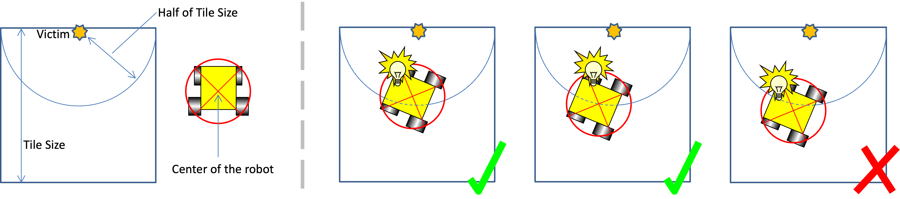

# How points are earned (and lost)

This is the page that turns "find victims and draw a map" into an actual strategy. Every action your
robot takes in a round is worth something, positive or negative, and where it happens changes how much.
This page defines each piece, then walks the official worked example all the way to its final score, by
hand, so every number is traceable.

!!! note "Where this fits"
    Third of five pages building on the [official rules](official-rules-2026.md). Previous:
    [Victims and hazmats](rules-tokens.md). Next: [Drawing the map](rules-map-format.md).

## The building blocks

| Code | Name | What it means |
|---|---|---|
| **TI** | Wall Token Identification | Your robot stopped at a wall token for 1+ second and reported it. |
| **TT** | Wall Token Type Identification | On top of TI: the *type* it reported (which letter, which hazmat) was correct. |
| **CN** | Checkpoint Negotiation | Your robot's center passed over a checkpoint tile. |
| **TMI** | Wall Token Misidentification | Your robot reported a token that isn't there, in the wrong place, or mixed up a victim for a hazard. |
| **LoP** | Lack of Progress | Your robot got stuck, fell in a hole, or otherwise needed to be reset to the last checkpoint. |
| **AM** | Area Multiplier | Everything earned in a given area gets scaled by how hard that area is. |
| **EB** | Exit Bonus | A reward for finishing the job: getting back to the start and calling it. |
| **MB** | Mapping Bonus | A reward for how accurate the map you submitted is. |

### Identifying a token correctly

To count as a successful identification, your robot's center has to be within **half a tile** of the
token's true location at the moment it reports it. Any farther than that, and it's a
misidentification instead.

*Figure: official RoboCupJunior Rescue Simulation Rules 2026. The two green checkmarks are close enough; the red X is not.*

### Point values

| | Linear tile, Areas 1–3 | Floating tile, Areas 1–3, or anywhere in Area 4 |
|---|---|---|
| Letter victim — TI | 5 pts | 15 pts |
| Letter victim — TT (if type is also correct) | +10 pts | +10 pts |
| Cognitive target — TI | 10 pts | 30 pts |
| Cognitive target — TT (if type is also correct) | +20 pts | +20 pts |

Floating tiles and Area 4 are worth 3× as much for TI, because they're harder to reach. TT is a flat
bonus on top, for reporting the correct type, not just that *something* is there.

- **TMI** (misidentification): −5 points, wherever it happens.
- **CN** (checkpoint): +10 points, wherever it happens.
- **LoP**: −5 points, wherever it happens.
- Neither TMI nor LoP scale with the area multiplier, only TI, TT, and CN do.
- No duplicate rewards: revisiting the same checkpoint or re-reporting the same token twice only ever
  counts once.
- Total score can never go below zero.

### Area multipliers

| Area | Multiplier |
|---|---|
| 1 | ×1 |
| 2 | ×1.25 |
| 3 | ×1.5 |
| 4 | ×2 |

### Bonuses, applied last

- **Exit bonus (EB):** if your robot has identified at least one wall token *and* returns to the
  starting tile while sending an `exit` command, add 10% on top of everything scored so far.
- **Mapping bonus (MB):** submit a map matrix (see [Drawing the map](rules-map-format.md)) and the
  organizers compare it to the real one. The bonus is a multiplier between 1 and 2:
  `correctness × 1.2 + 1`, where a perfectly correct map gives `1 × 1.2 + 1 = 2.2`, and a completely
  wrong one gives `0 × 1.2 + 1 = 1` (i.e. no penalty for trying, but no reward either).

## Worked example, step by step

This reproduces the official worked example in the rules, one arithmetic step at a time, so you can
follow exactly how 2680.15 is reached.

*Figure: official RoboCupJunior Rescue Simulation Rules 2026.*

**Step 1 — score TI + TT + CN separately in each area, then apply that area's multiplier.**

Area 1 (×1): 2 linear-tile letter TIs (2×5=10) + 4 linear-tile cognitive TIs (4×10=40) + 0 floating +
2 letter TTs (2×10=20) + 3 cognitive TTs (3×20=60) + 1 CN (1×10=10) = **140** raw → ×1 = **140**

Area 2 (×1.25): (1×5)+(1×10)+(3×15)+(2×30) = 5+10+45+60 = 120, plus TT (4×10)+(3×20) = 40+60 = 100,
plus CN (1×10) = 10 → raw total 230 → ×1.25 = **287.5**

Area 3 (×1.5): (2×5)+(2×10)+(4×15)+(3×30) = 10+20+60+90 = 180, plus TT (6×10)+(3×20) = 60+60 = 120,
plus CN 10 → raw total 310 → ×1.5 = **465**

Area 4 (×2): (1×5)+(1×10)+(1×15)+(1×30) = 5+10+15+30 = 60, plus TT (2×10)+(2×20) = 20+40 = 60,
plus CN 10 → raw total 130 → ×2 = **260**

Add the four areas together: 140 + 287.5 + 465 + 260 = **1152.5**

**Step 2 — subtract TMI and LoP penalties (flat, no multiplier).**

Area 1: 1 TMI + 2 LoP = −5 − 10 = −15
Area 2: 0 TMI + 1 LoP = −5
Area 3: 2 TMI + 1 LoP = −10 − 5 = −15
Area 4: 0 TMI + 2 LoP = −10

Total penalties: −15 − 5 − 15 − 10 = **−45**

**Step 3 — combine.**

1152.5 − 45 = **1107.5**

**Step 4 — apply the exit bonus (this team made it back and called exit).**

1107.5 × 1.1 = **1218.25**

**Step 5 — apply the mapping bonus (this example assumes a perfectly correct map, so MB = 2.2).**

1218.25 × 2.2 = **2680.15**

That's the final field score for this round.

## Check yourself

??? question "A robot identifies a cognitive target on a floating tile in Area 2, and gets the type right. How many raw points before the area multiplier?"
    Floating-tile cognitive target TI is 30, plus TT is 20 → 50 raw points, before the ×1.25 area
    multiplier is applied (→ 62.5 after).

??? question "Why do TMI and LoP not get multiplied by area, when TI/TT/CN do?"
    The rules apply the area multiplier only to TI, TT, and CN (the rewards). TMI and LoP are flat
    −5 penalties everywhere, so a mistake in the hardest area doesn't cost proportionally more than
    the same mistake in Area 1.

## What's next

The mapping bonus deserves its own page, since the matrix format is the trickiest thing to get right:
[Drawing the map](rules-map-format.md).

Unfamiliar word? Check the [glossary](glossary.md#rules-scoring-words).
