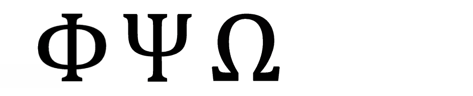
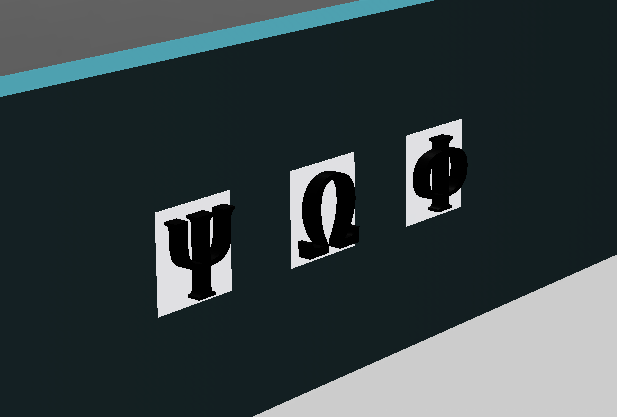
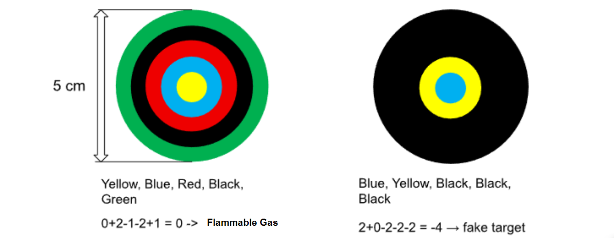
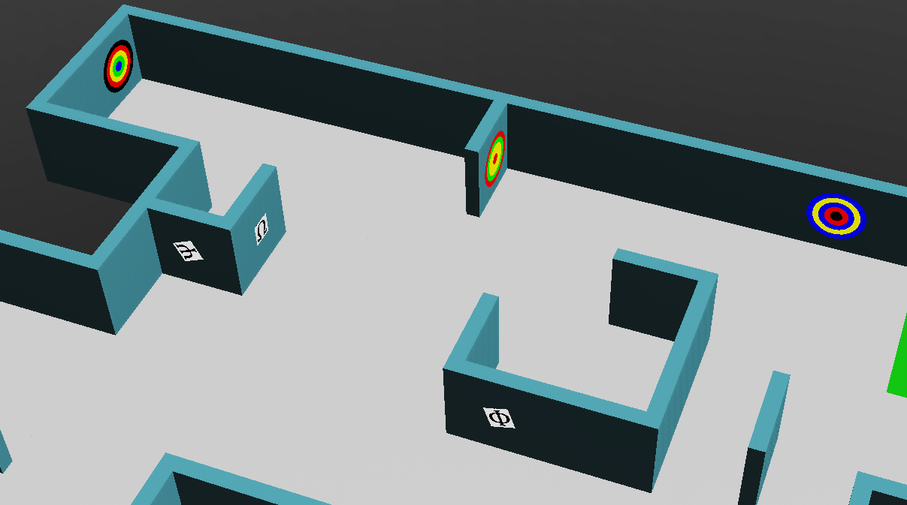

# Victims and hazmats

This is the part of the rules students usually find the most fun, and the part that trips them up the
most on a first read. Your robot is looking for two kinds of markers on the walls: **letter victims**
and **cognitive targets**. This page walks through both, including the ring-decoding math behind
cognitive targets, with practice you can check yourself against.

!!! note "Where this fits"
    Second of five pages building on the [official rules](official-rules-2026.md). Previous:
    [Understanding the field](rules-field.md). Next: [How points are earned](rules-scoring.md).

## Letter victims: Φ, Ψ, Ω

A letter victim is a small (2 cm × 2 cm) black letter printed on a wall, in a plain sans-serif font. It
tells you the health status of a victim at that spot:

| Symbol | Meaning | Health status code |
|---|---|---|
| **Φ** | Harmed victim | H |
| **Ψ** | Stable victim | S |
| **Ω** | Unharmed victim | U |


*Figure: official RoboCupJunior Rescue Simulation Rules 2026.*


*Figure: official RoboCupJunior Rescue Simulation Rules 2026.*

These three Greek letters look nothing like the "H / S / U" they stand for on purpose. Don't try to
match them by shape; just memorise the table. Flashcards help here more than you'd expect.

!!! warning "Some wall tokens are fake"
    You can also find wall tokens with these same symbols, but rendered with visible **3D depth**
    instead of flat print. Your robot can tell the difference using one of its sensors. These
    3D/textured tokens are decoys: **do not report them**, and don't put them on your map. Reporting
    a fake as real costs you points (it's a misidentification, see
    [How points are earned](rules-scoring.md)).

## Cognitive targets: reading the rings

A cognitive target represents a hazardous chemical (a "hazmat"). Instead of a letter, this token is a
5 cm circle made of concentric rings, like a tiny archery target. Each ring, and the centre circle, is
coloured, and each colour stands for a number:

| Colour | Value |
|---|---|
| Black | −2 |
| Red | −1 |
| Yellow | 0 |
| Green | 1 |
| Blue | 2 |

To decode a target: read the colours from the **centre outward** (centre circle, then ring 1, ring 2,
ring 3, ring 4), convert each to its number, and add all 5 together. The total tells you the hazmat:

| Sum | Hazmat |
|---|---|
| 0 | Flammable Gas [F] |
| 1 | Poison [P] |
| 2 | Corrosive [C] |
| 3 | Organic Peroxide [O] |
| anything else | Fake target — don't report it |

**Important:** if two adjacent rings happen to be the same colour, you still count them separately.
Never merge them into one ring. Always sum all 5 values.


*Figure: official RoboCupJunior Rescue Simulation Rules 2026.*

Walking through the left example above, centre to outward: Yellow, Blue, Red, Black, Green.

```
Yellow  =  0
Blue    = +2
Red     = -1
Black   = -2
Green   = +1
         ----
 total  =  0   →  Flammable Gas [F]
```

The right example: Blue, Yellow, Black, Black, Black.

```
Blue  = +2
Yellow =  0
Black = -2
Black = -2
Black = -2
       ----
total = -4   →  not 0, 1, 2, or 3, so this is a FAKE target
```

## Your turn: decode these four

Work these out on paper first (colours are listed centre-to-outward), then open each answer to check
yourself.

**Target 1:** Red, Blue, Yellow, Yellow, Yellow

??? question "Check your answer"
    −1 + 2 + 0 + 0 + 0 = **1** → **Poison [P]**

**Target 2:** Black, Blue, Blue, Yellow, Yellow

??? question "Check your answer"
    −2 + 2 + 2 + 0 + 0 = **2** → **Corrosive [C]**

**Target 3:** Green, Green, Green, Yellow, Yellow

??? question "Check your answer"
    1 + 1 + 1 + 0 + 0 = **3** → **Organic Peroxide [O]**

**Target 4:** Black, Black, Red, Yellow, Green

??? question "Check your answer"
    −2 − 2 − 1 + 0 + 1 = **−4** → not 0–3, so this is a **fake target**. Don't report it.

Want a printable version of this exercise to hand out? See the
[cognitive target decoder](cognitive-target-decoder.md) one-pager.

## Spotting them in the maze

Both kinds of wall tokens can appear on any wall your robot can get close enough to, including curved
Area 3 walls. However, they never appear inside the one-tile passages that connect areas.
Letter-victim signs can also be rotated, anywhere from −180° to 180°, so don't assume they're always
sitting upright.


*Figure: official RoboCupJunior Rescue Simulation Rules 2026.*

## What's next

To find out what each of these is actually worth, and what makes the score go up or down, read
[How points are earned](rules-scoring.md) next. You now know what your robot is hunting for.

Unfamiliar word? Check the [glossary](glossary.md#rules-scoring-words).
