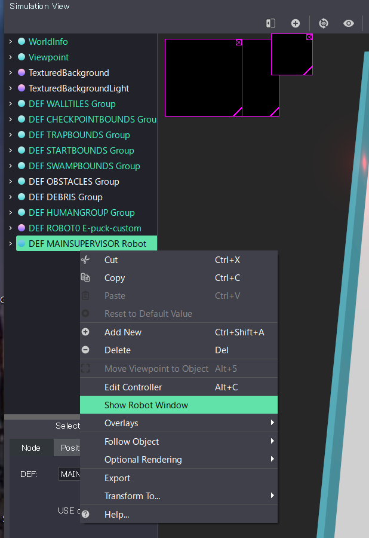
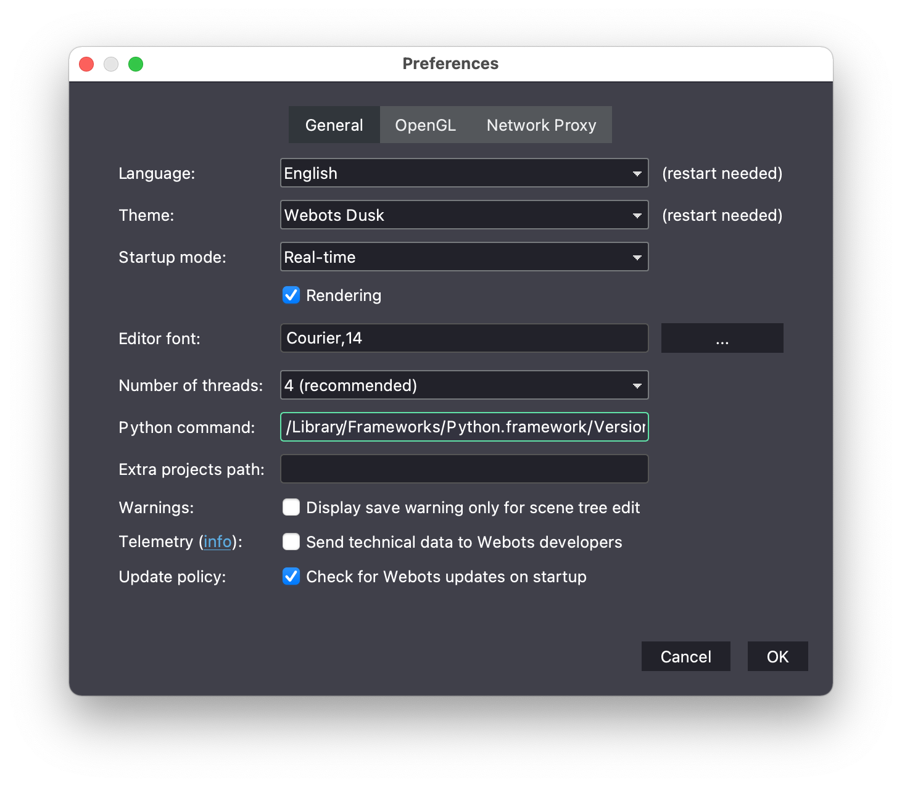

# When it goes wrong

Find the thing you're seeing on screen in the list below and jump to it. Each fix tells you **what
you'll see**, **why it happens**, and **exactly what to do**. None of this is your fault. These are
just the normal rough edges of setting up a robotics simulator.

!!! tip "How to use this page"
    Use your browser's find (<kbd>Ctrl</kbd> or <kbd>Cmd</kbd> + <kbd>F</kbd>) and paste in the exact
    error text. If your problem isn't here, re-read the step you were on. Most failures come from one
    skipped click, usually the Python "Add to PATH" box.

## Quick index

| What you're seeing | Jump to |
|---|---|
| No "Release Build" file to download | [1. There's no file to download](#1-theres-no-release-build-file-to-download) |
| Webots window is blank or black | [2. Blank or black screen](#2-webots-opens-to-a-blank-or-black-screen) |
| Stuck on "Initializing…" | [3. Stuck on Initializing](#3-its-stuck-on-initializing) |
| Left-side Competition panel missing | [4. The Supervisor panel is missing](#4-the-competition-supervisor-panel-doesnt-appear) |
| `WARNING: Python was not found` | [5. Python was not found](#5-warning-python-was-not-found) |
| Can't load or choose a controller | [6. Can't load a controller](#6-cant-load-a-controller) |
| `python` opens the Store or "not recognized" | [7. Python isn't on the PATH](#7-typing-python-does-nothing-windows) |
| Everything runs very slowly | [8. The simulation is slow](#8-the-simulation-runs-slowly) |

---

## 1. There's no "Release Build" file to download

**You'll see:** you reach the Erebus [releases page](https://github.com/robocup-junior/erebus/releases/latest)
and there's no file called "Release Build" or "Erebus.zip." There's only "Source code (zip)."

**Why:** recent Erebus releases (v25 and v26) stopped attaching a packaged build. These days the
"Source code (zip)" *is* the complete, runnable package.

**Fix:** under **Assets**, download **"Source code (zip)"**, then unzip it. That folder contains
`game`, `player_controllers`, and everything you need.

---

## 2. Webots opens to a blank or black screen

**You'll see:** Webots launches, but the 3D area is empty or solid black, with no maze.

**Why:** you opened `world1.wbt` from *inside* the downloaded zip (a preview), not from a real
unzipped folder.

**Fix:** properly unzip or extract the Erebus download to a normal folder first. On Windows, use
**Extract All**, not double-click-to-peek. Then open `game/worlds/world1.wbt` from that folder.

---

## 3. It's stuck on "Initializing…"

**You'll see:** the message **"Initializing…"** for a long time the first time you open a world.

**Why:** the very first run installs several Python libraries in the background. This normally takes
one to three minutes. It looks frozen, but it usually isn't.

**Fix:**

1. **Wait a couple of minutes.** This is expected on the first run only.
2. If it truly never finishes, open the console (the text area at the bottom of Webots) and read any
   error there. A red line like `ModuleNotFoundError: No module named 'cv2'` means one library
   didn't install. See the note below.
3. Install the libraries yourself, then reopen the world:
    - **Windows:** open Command Prompt and run `python -m pip install numpy termcolor requests opencv-python pillow overrides`
    - **macOS or Linux:** open a terminal and run `python3 -m pip install numpy termcolor requests opencv-python pillow overrides`

!!! warning "The docs only mention three libraries, but the simulator needs more"
    The official install pages list `numpy termcolor requests`, but the Competition Supervisor also
    needs **`opencv-python`** (imported as `cv2`), **`pillow`**, and **`overrides`**. On a brand-new
    Python, `opencv-python` in particular is *not* installed automatically, and the supervisor
    crashes with `ModuleNotFoundError: No module named 'cv2'`. If you hit that, run the full `pip`
    command above. That's the complete list, and we confirmed it on a real first run.

---

## 4. The Competition Supervisor panel doesn't appear

**You'll see:** the maze loads, but the left-side panel with the LOAD button, timer, and score is
missing.

**Why:** the Supervisor's robot window sometimes doesn't pop up on its own.

**Fix:**

1. In the top menu, open **Tools → Scene Tree**.
2. In the tree, find **`DEF MAINSUPERVISOR Robot`**, right-click it, and choose
   **"Show Robot Window"**.

    

    *Screenshot: RoboCupJunior Erebus documentation, Apache-2.0.*

3. If it still doesn't open, paste this into your web browser:
   `http://localhost:1234/robot_windows/MainSupervisorWindow/MainSupervisorWindow.html?name=robot`

---

## 5. `WARNING: Python was not found`

**You'll see:** this warning in the Webots console, and the robot won't run.

**Why:** Webots doesn't know where your Python is.

**Fix (macOS or Linux):**

1. In a terminal, find your Python by running `which python3`. It prints a path.
2. In Webots, open **Webots → Preferences** (macOS) or **Tools → Preferences** (Linux).
3. Paste that path into the **"Python command"** field.

    

    *Screenshot: RoboCupJunior Erebus documentation, Apache-2.0.*

**On Windows** this is almost always a PATH problem. See
[7. Typing `python` does nothing](#7-typing-python-does-nothing-windows).

---

## 6. Can't load a controller

**You'll see:** pressing **LOAD** does nothing useful, or the robot never moves after loading.

**Why:** Webots can't find or run Python, so it can't run the controller file.

**Fix:**

1. Make sure you picked the right file:
   `player_controllers/ExamplePlayerController_updated.py`.
2. Confirm Python runs on its own. Open a terminal or Command Prompt and type `python` (Windows) or
   `python3` (macOS or Linux). If that fails, fix Python first (sections 5 and 7).
3. Tell Webots where Python is, under **Preferences → Python command** (see section 5).

---

## 7. Typing `python` does nothing (Windows)

**You'll see:** in Command Prompt, `python` opens the Microsoft Store, or it says
`'python' is not recognized`.

**Why:** the **"Add python.exe to PATH"** box wasn't ticked when Python was installed, so Windows
can't find it.

**Fix (easiest):**

1. Re-run the Python installer, choose **Modify**, and make sure **"Add python.exe to PATH"** is
   ticked. Or just reinstall and tick it on the first screen (see
   [Install on Windows](install-windows.md)).
2. Open a **new** Command Prompt and type `python`. It should now start Python.
3. Then set it in Webots, under **Tools → Preferences → Python command**, and enter `python`.

Paths can be fiddly. This is the single most common Windows snag, and it's normal to take a couple
of tries.

---

## 8. The simulation runs slowly

**You'll see:** the robot and maze move in slow, choppy steps.

**Why:** 3D simulation is demanding, and an older or low-powered computer feels it most.

**Fix:** lower the graphics quality. This only affects your own testing, not a real competition:

1. Open **Webots → Preferences** (macOS) or **Tools → Preferences** (Windows or Linux).
2. Open the **OpenGL** tab.
3. Turn the quality settings down.

---

## Still stuck?

If none of these match, note the **exact** text of the error in the Webots console and which step
you were on. Then re-read the install page for your system,
[Windows](install-windows.md), [macOS](install-mac.md), or [Linux](install-linux.md), with that
error in mind. That usually reveals the missed step.

If it's still not fixed, ask a person:

- The **Erebus Discord server** is where most technical setup questions actually get answered
  (faster than the forum). Look for the invite link on the
  [Erebus GitHub page](https://github.com/robocup-junior/erebus).
- The [RoboCupJunior Rescue Simulation forum](https://junior.forum.robocup.org/c/rescue-simulation)
  is good for rules questions and searching past setup problems other teams have hit.
